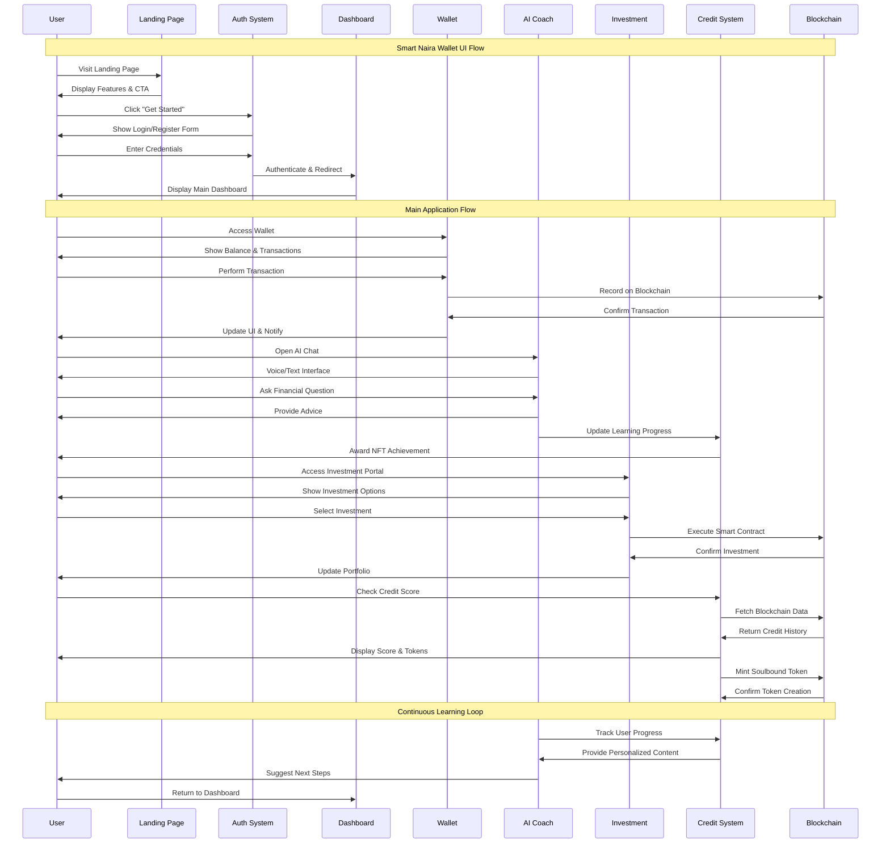
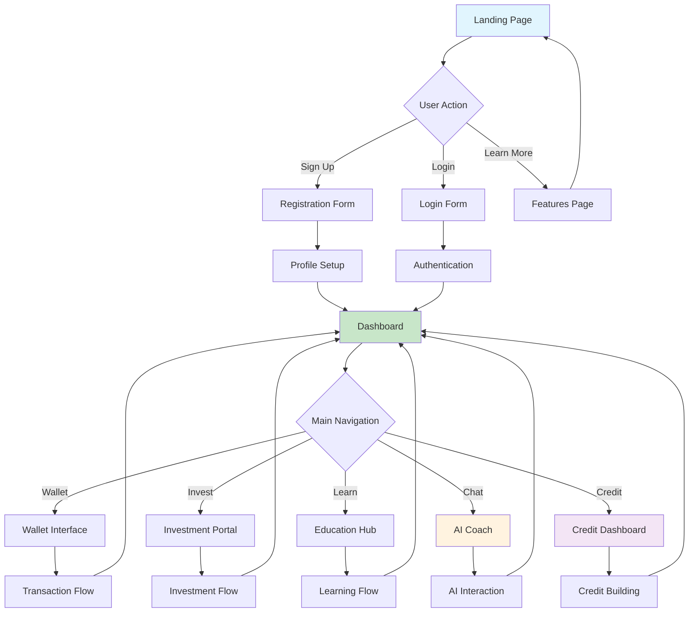
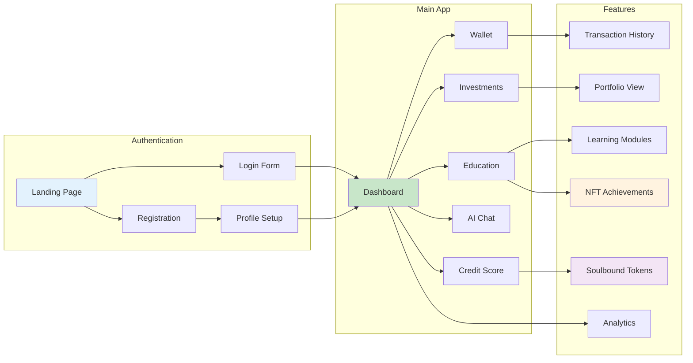
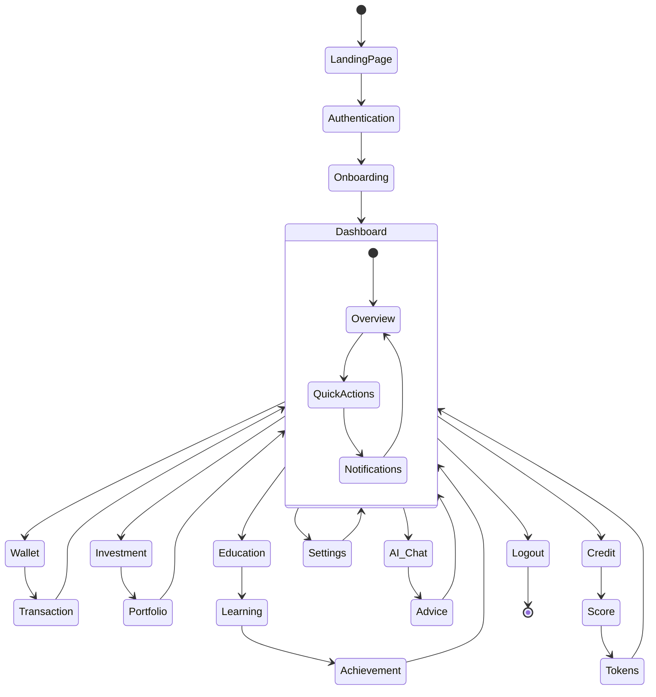
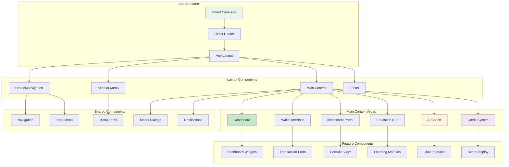
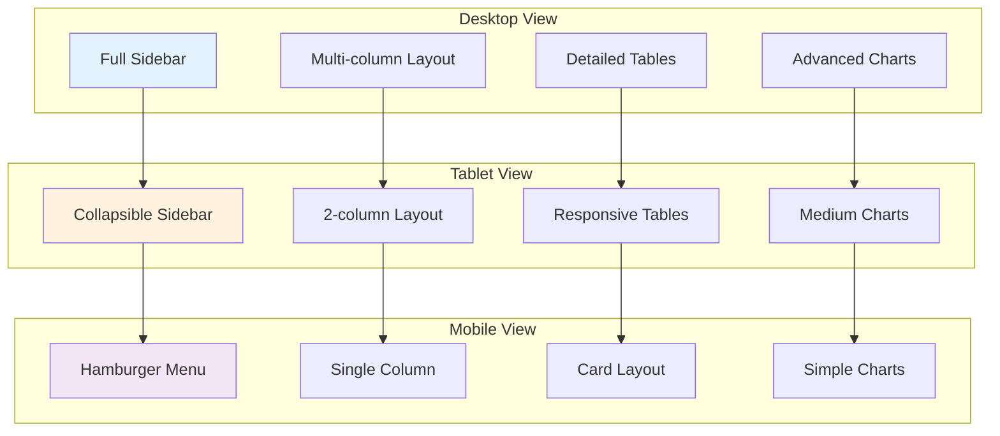
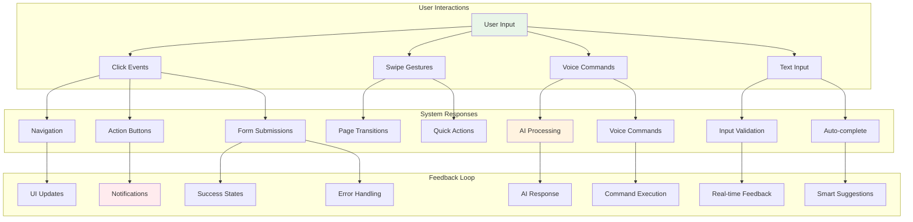
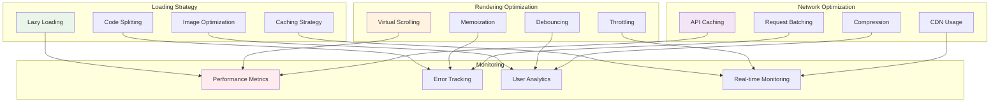
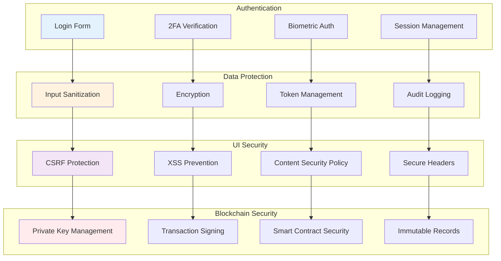

# Smart Naira Wallet - UI Flowchart Diagram

## User Interface Flow Sequence



## Component Interaction Flow



## Screen Navigation Map



## User Journey States



## UI Component Hierarchy



## Responsive Design Flow



## Interactive Elements Flow



## Accessibility Flow

```mermaid
graph TD
    subgraph "Accessibility Features"
        A1[Screen Reader Support]
        A2[Keyboard Navigation]
        A3[High Contrast Mode]
        A4[Voice Commands]
        A5[Large Text Options]
    end
    
    subgraph "Implementation"
        A1 --> ARIA[ARIA Labels]
        A1 --> Semantics[Semantic HTML]
        
        A2 --> Focus[Focus Management]
        A2 --> Shortcuts[Keyboard Shortcuts]
        
        A3 --> Themes[Theme Switching]
        A3 --> Colors[Color Adjustments]
        
        A4 --> Speech[Speech Recognition]
        A4 --> Commands[Command Processing]
        
        A5 --> Scaling[Text Scaling]
        A5 --> Spacing[Spacing Adjustments]
    end
    
    subgraph "Testing"
        ARIA --> Testing[Accessibility Testing]
        Focus --> Testing
        Themes --> Testing
        Speech --> Testing
        Scaling --> Testing
    end
    
    style A1 fill:#e3f2fd
    style Speech fill:#fff3e0
    style Testing fill:#ffebee
```

## Performance Optimization Flow



## Security Flow



## Key UI Principles

1. **User-Centric Design**: All flows start and end with user needs
2. **Progressive Disclosure**: Complex features revealed gradually
3. **Consistent Navigation**: Predictable user experience
4. **Accessibility First**: Inclusive design for all users
5. **Performance Focus**: Fast, responsive interactions
6. **Security Integration**: Secure by design
7. **Mobile-First**: Responsive across all devices
8. **AI Integration**: Seamless AI assistance throughout
9. **Gamification**: Engaging learning and achievement systems
10. **Blockchain Transparency**: Clear Web3 integration

## Color Scheme & Branding

- **Primary Green**: #10B981 (Success, Money, Growth)
- **Secondary Blue**: #3B82F6 (Trust, Technology, Security)
- **Accent Orange**: #F59E0B (Energy, Innovation, AI)
- **Neutral Gray**: #6B7280 (Text, Borders, Backgrounds)
- **Success Green**: #059669 (Positive actions, achievements)
- **Warning Orange**: #D97706 (Alerts, notifications)
- **Error Red**: #DC2626 (Errors, critical actions)
- **Info Blue**: #2563EB (Information, links)

## Typography Hierarchy

- **Heading 1**: 48px, Bold (Main titles)
- **Heading 2**: 36px, Semibold (Section headers)
- **Heading 3**: 24px, Medium (Subsection headers)
- **Body Large**: 18px, Regular (Important text)
- **Body Medium**: 16px, Regular (Main content)
- **Body Small**: 14px, Regular (Secondary text)
- **Caption**: 12px, Regular (Metadata, labels)

## Component Library

### Navigation Components
- Header with logo and user menu
- Sidebar with main navigation
- Breadcrumb navigation
- Pagination controls
- Tab navigation

### Form Components
- Input fields with validation
- Dropdown selectors
- Checkbox and radio buttons
- File upload components
- Search with autocomplete

### Feedback Components
- Success/error notifications
- Loading spinners
- Progress bars
- Toast messages
- Modal dialogs

### Data Display Components
- Data tables with sorting
- Charts and graphs
- Card layouts
- List views
- Detail panels

### Interactive Components
- Buttons (primary, secondary, ghost)
- Toggle switches
- Sliders and range inputs
- Drag and drop interfaces
- Voice command interface 