# Smart Naira Wallet - Visual UI Flow Diagram

## Main Application Flow

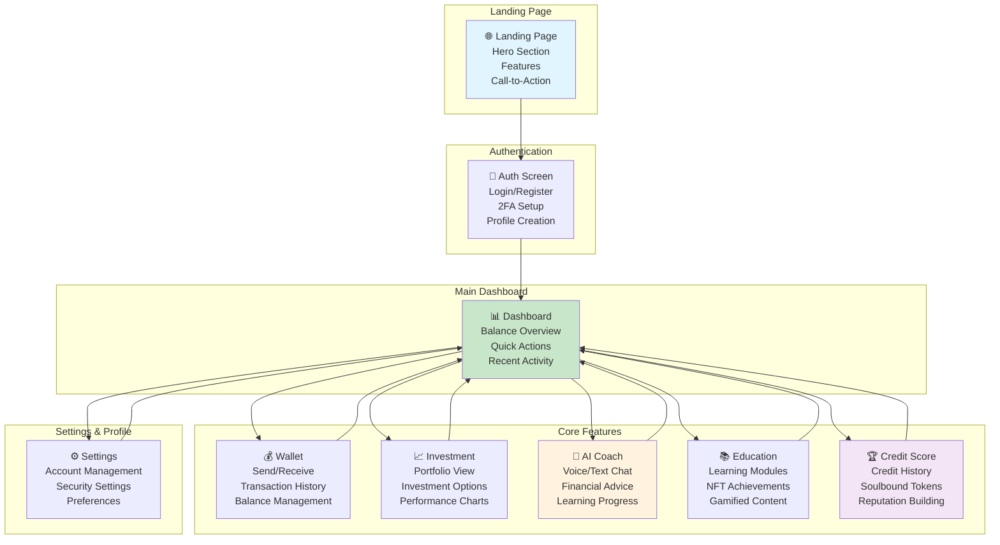

## Screen Layout Flow

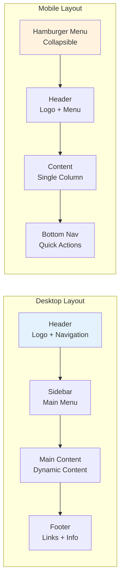

## User Interface Components

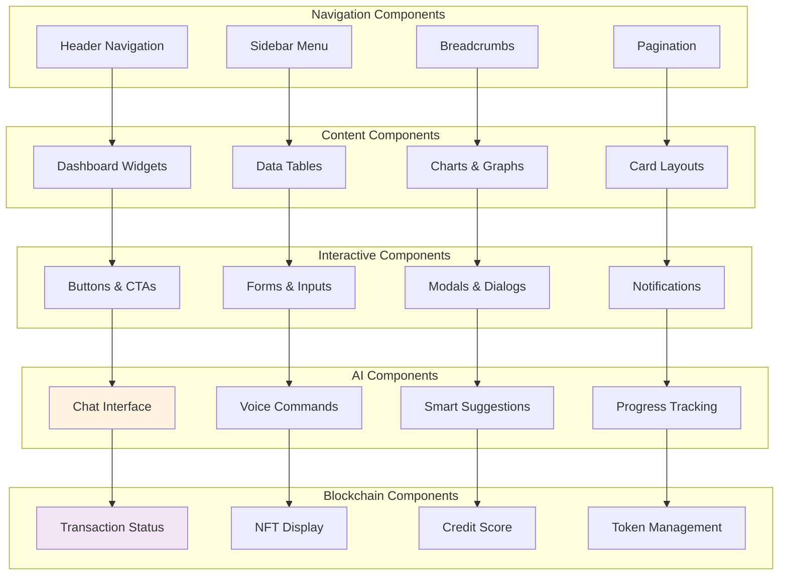

## Dashboard Layout Flow

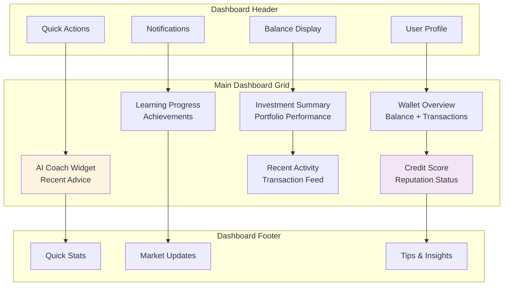

## Mobile UI Flow

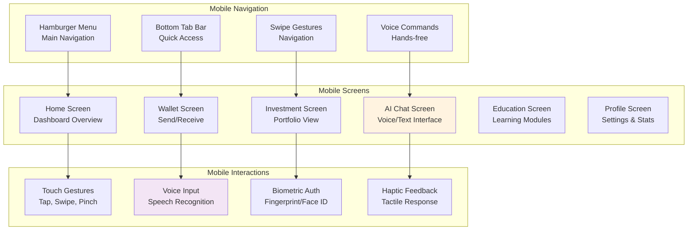

## AI Integration UI Flow

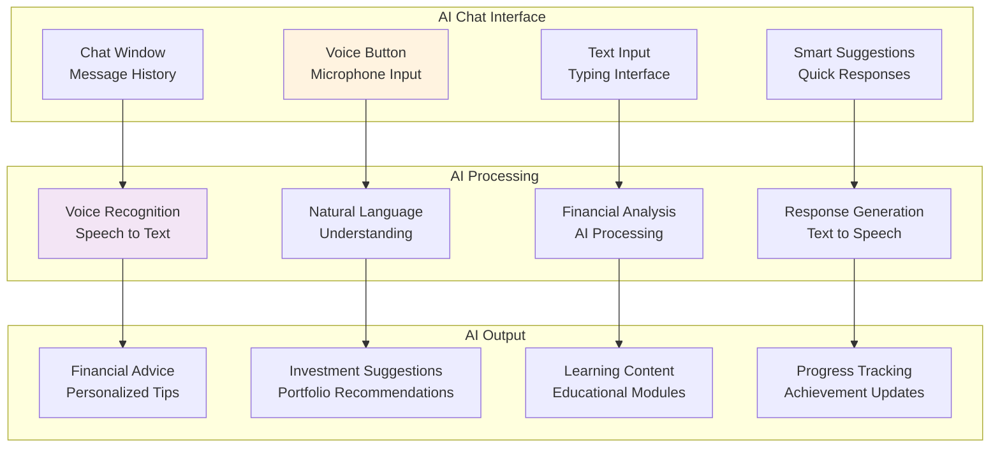

## Blockchain Integration UI Flow

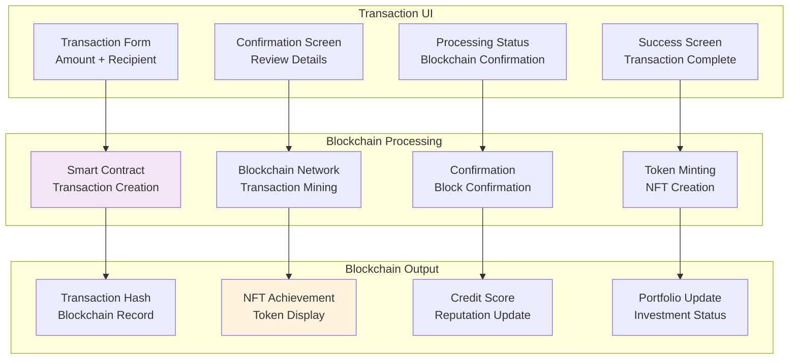

## Responsive Design Flow

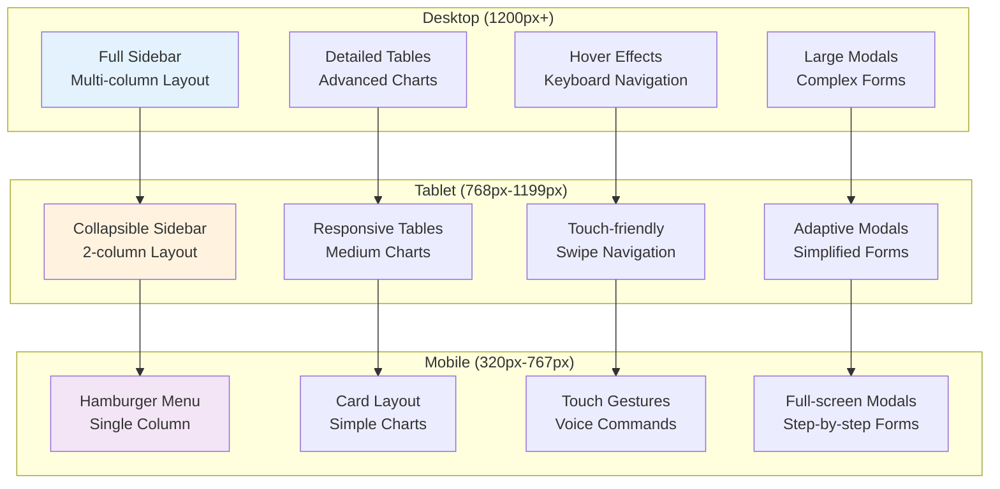

## Color Scheme & Visual Hierarchy

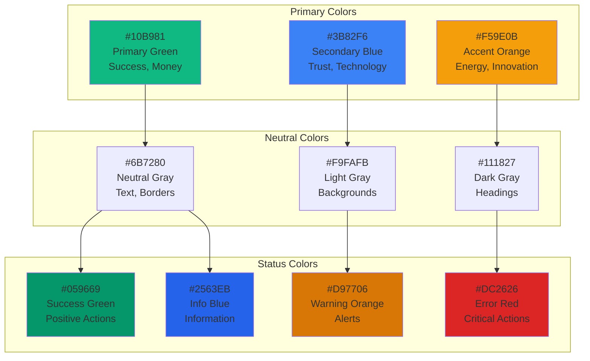

## Component States & Interactions

```mermaid
graph TD
    subgraph "Button States"
        BS1[Default State<br/>Primary Button]
        BS2[Hover State<br/>Elevated Shadow]
        BS3[Active State<br/>Pressed Effect]
        BS4[Loading State<br/>Spinner + Disabled]
        BS5[Success State<br/>Checkmark + Green]
        BS6[Error State<br/>Red Border + Message]
    end
    
    subgraph "Form States"
        FS1[Empty State<br/>Placeholder Text]
        FS2[Focused State<br/>Blue Border + Label]
        FS3[Valid State<br/>Green Checkmark]
        FS4[Invalid State<br/>Red Border + Error]
        FS5[Loading State<br/>Spinner + Disabled]
        FS6[Success State<br/>Success Message]
    end
    
    subgraph "Navigation States"
        NS1[Default State<br/>Normal Link]
        NS2[Hover State<br/>Underline + Color]
        NS3[Active State<br/>Bold + Background]
        NS4[Selected State<br/>Highlighted]
        NS5[Disabled State<br/>Grayed Out]
        NS6[Loading State<br/>Skeleton]
    end
    
    BS1 --> BS2
    BS2 --> BS3
    BS3 --> BS4
    BS4 --> BS5
    BS5 --> BS6
    
    FS1 --> FS2
    FS2 --> FS3
    FS3 --> FS4
    FS4 --> FS5
    FS5 --> FS6
    
    NS1 --> NS2
    NS2 --> NS3
    NS3 --> NS4
    NS4 --> NS5
    NS5 --> NS6
    
    style BS1 fill:#10B981
    style FS3 fill:#059669
    style NS3 fill:#3B82F6
```

## Accessibility & Inclusive Design

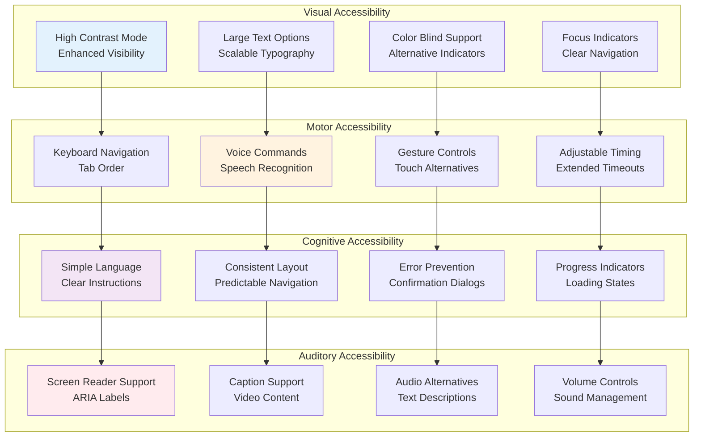

## Performance & Loading States

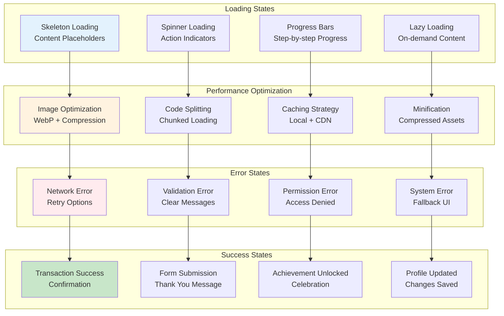

## Key UI Design Principles

1. **Mobile-First Design**: Responsive across all devices
2. **Progressive Enhancement**: Core functionality works everywhere
3. **Accessibility First**: Inclusive design for all users
4. **Performance Focus**: Fast loading and smooth interactions
5. **Consistent Design**: Unified visual language
6. **User-Centric**: Intuitive and helpful interfaces
7. **Security Integration**: Secure by design
8. **AI Enhancement**: Smart assistance throughout
9. **Gamification**: Engaging and motivating experiences
10. **Blockchain Transparency**: Clear Web3 integration

## Visual Design System

### Typography Scale
- **Display Large**: 64px (Hero headlines)
- **Display Medium**: 48px (Page titles)
- **Heading Large**: 36px (Section headers)
- **Heading Medium**: 24px (Subsection headers)
- **Heading Small**: 20px (Card titles)
- **Body Large**: 18px (Important text)
- **Body Medium**: 16px (Main content)
- **Body Small**: 14px (Secondary text)
- **Caption**: 12px (Metadata)

### Spacing Scale
- **4px**: Micro spacing (icons, small elements)
- **8px**: Small spacing (form elements)
- **16px**: Medium spacing (sections)
- **24px**: Large spacing (major sections)
- **32px**: Extra large spacing (page sections)
- **48px**: Hero spacing (major page breaks)

### Border Radius
- **4px**: Small radius (buttons, inputs)
- **8px**: Medium radius (cards, modals)
- **12px**: Large radius (hero sections)
- **16px**: Extra large radius (feature sections)

### Shadows
- **Small**: 0 1px 2px rgba(0,0,0,0.05)
- **Medium**: 0 4px 6px rgba(0,0,0,0.1)
- **Large**: 0 10px 15px rgba(0,0,0,0.1)
- **Extra Large**: 0 20px 25px rgba(0,0,0,0.15) 